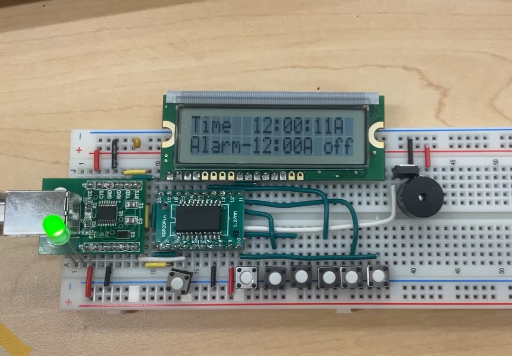

# assemblyalarmclock
Fully functioning alarm clock built with N76E003 microcontroller and intel assembly 8051 microcontroller instruction set. 

Features:
 - Displays time in 12 hour mode on LCD
 - Current time (hours, minutes, seconds, AM/PM) settable using pushbuttons
 - Settable alarm with mini-speaker/MOSFET setup for alarm sound 
